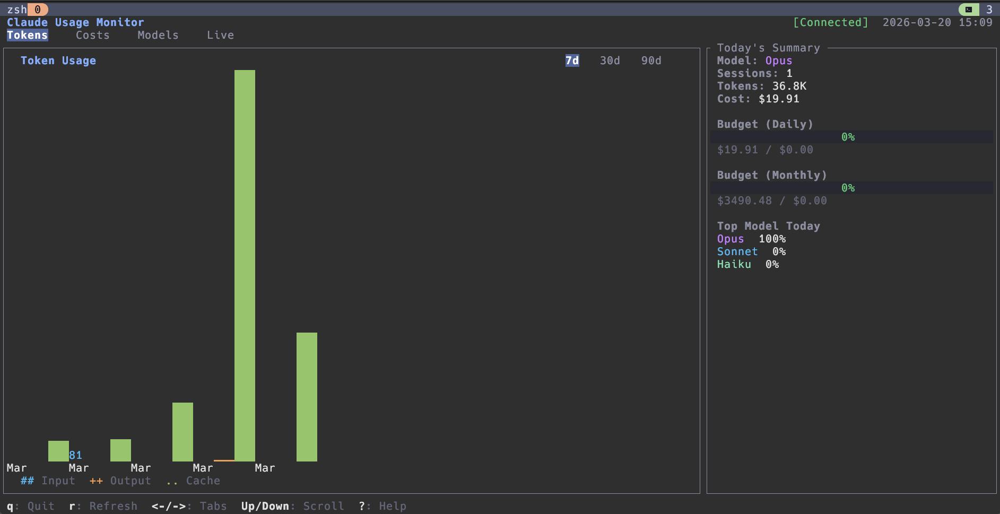
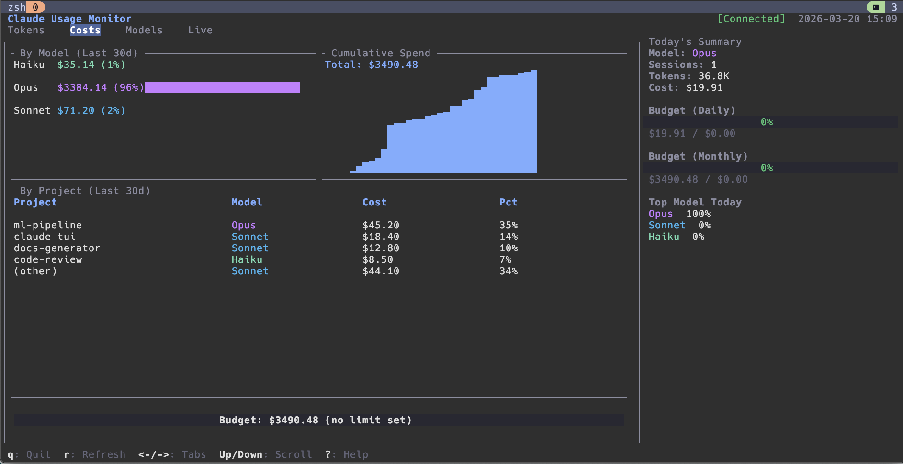
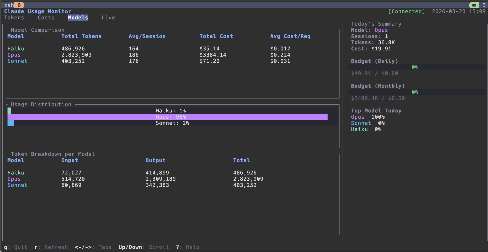
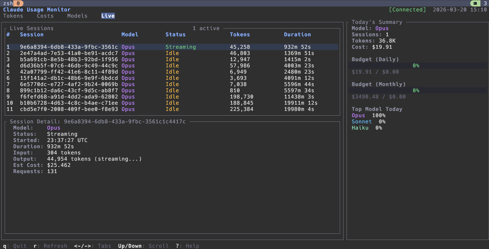

# **WARNING** This project may contain security vulnerabilities, or at least memory and code-quality issues. Built in a weekend to test out personal Claude Vibe-Code Workflow and for local development and playtest only. Use at your own risk.
# claude-tui

A terminal dashboard for monitoring Claude Code usage and costs — built entirely around local data. No API keys, no network calls, no telemetry. The daemon reads only from Claude Code's local JSONL logs on your machine.

## Demo

1. Fetches data for cost, model, token usage, and active sessions in local machine.
- 

- 

- 

- 
2. Can integrate to your existing sketchybar config.
- 

## Architecture

```
┌─────────────┐    Unix Socket     ┌──────────────┐    ┌──────────────────────┐
│  claude-tui  │◄──(JSON-RPC 2.0)──►│ claude-daemon │───►│  SQLite (WAL mode)   │
│  (ratatui)   │                    │              │    └──────────────────────┘
└─────────────┘                    │  Collector   │
                                   │  (log scan)  │───► ~/.claude/projects/**/*.jsonl
                                   └──────────────┘    (read-only, local files only)
```

| Crate | Role |
|---|---|
| **claude-tui** | Terminal UI — token charts, cost breakdowns, model comparison, live session monitor |
| **claude-daemon** | Background service — scans local Claude Code JSONL logs, stores parsed usage in SQLite |
| **claude-common** | Shared library — domain models, JSON-RPC 2.0 protocol, cost computation, error types |

## Features

- **Token usage charts** with 7/30/90-day time ranges
- **Cost breakdown** by model and project with budget gauges
- **Model comparison** — side-by-side stats for Opus, Sonnet, Haiku
- **Live session monitor** — active sessions with real-time token counts
- **Budget tracking** — configurable daily/monthly limits with alert thresholds

## Security and Privacy

This tool is designed to with an attempt to run safely on your personal machine:

- **No network access** — the daemon makes zero outbound connections. All data comes from local log files already on disk. The binary has no HTTP client dependency.
- **Read-only log access** — the collector only reads `~/.claude/projects/**/*.jsonl` files. It never writes to, modifies, or deletes Claude Code's data.
- **Owner-only IPC socket** — the Unix domain socket is created with `0600` permissions, restricting access to your user account.
- **Local SQLite storage** — all parsed data stays in a local database under `~/.local/share/claude-tui/`. Nothing leaves your machine.
- **No config files required** — runs with zero configuration. No API keys, tokens, or credentials needed.

## Technical Highlights

- **Async Rust** — tokio runtime with cancellation tokens for graceful shutdown
- **Daemon/client IPC** — JSON-RPC 2.0 over Unix domain sockets with owner-only permissions
- **SQLite with WAL** — concurrent reads, schema migrations, session reconstruction from raw usage records
- **Incremental log scanning** — per-file byte offset tracking so only new lines are parsed each cycle
- **Deterministic deduplication** — UUID v5 generation from log data prevents duplicate records across restarts
- **Responsive layout** — adapts between full sidebar and compact mode based on terminal width

## Quick Start

```bash
# Start the daemon (reads local Claude Code logs, stores in SQLite)
cargo run --bin claude-daemon

# Launch the TUI (connects to daemon, or runs in mock mode)
cargo run --bin claude-tui
```

**Keybindings:** `←/→` switch tabs | `↑/↓` scroll | `1/2/3` time range | `r` refresh | `q` quit

## Build

```bash
cargo build --release
cargo test
```

Requires Rust 1.85+ (edition 2024).

## Project Structure

```
crates/
├── claude-common/     # Shared types, protocol, cost models
│   └── src/
│       ├── models.rs      # UsageRecord, BudgetConfig, ModelType with pricing
│       ├── protocol.rs    # JSON-RPC 2.0 request/response, RPC method dispatch
│       ├── errors.rs      # Error types (storage, collector, IPC)
│       └── paths.rs       # XDG-compliant socket and database paths
├── claude-daemon/     # Background data collection service
│   └── src/
│       ├── collector.rs   # Log scanning with incremental byte-offset cursors
│       ├── storage.rs     # SQLite layer — migrations, queries, session rebuild
│       └── ipc.rs         # Unix socket server with owner-only permissions
└── claude-tui/        # Terminal interface
    └── src/
        ├── app.rs         # Main app loop, tab navigation, data refresh
        ├── client.rs      # Daemon IPC client
        ├── widgets/       # Token chart, cost breakdown, model compare, live monitor
        └── theme.rs       # Color palette and style constants
```

## License

MIT
